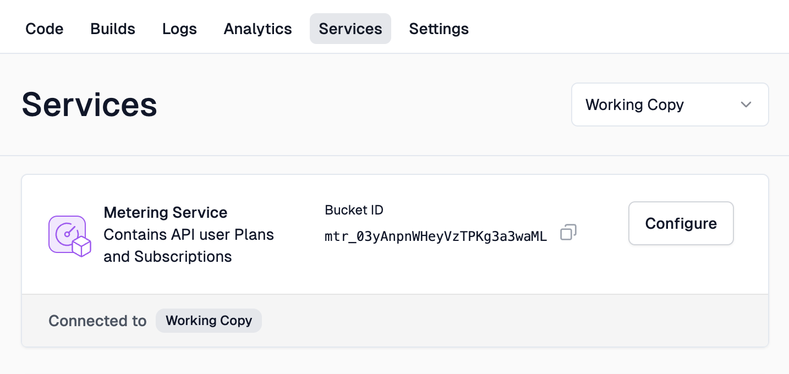
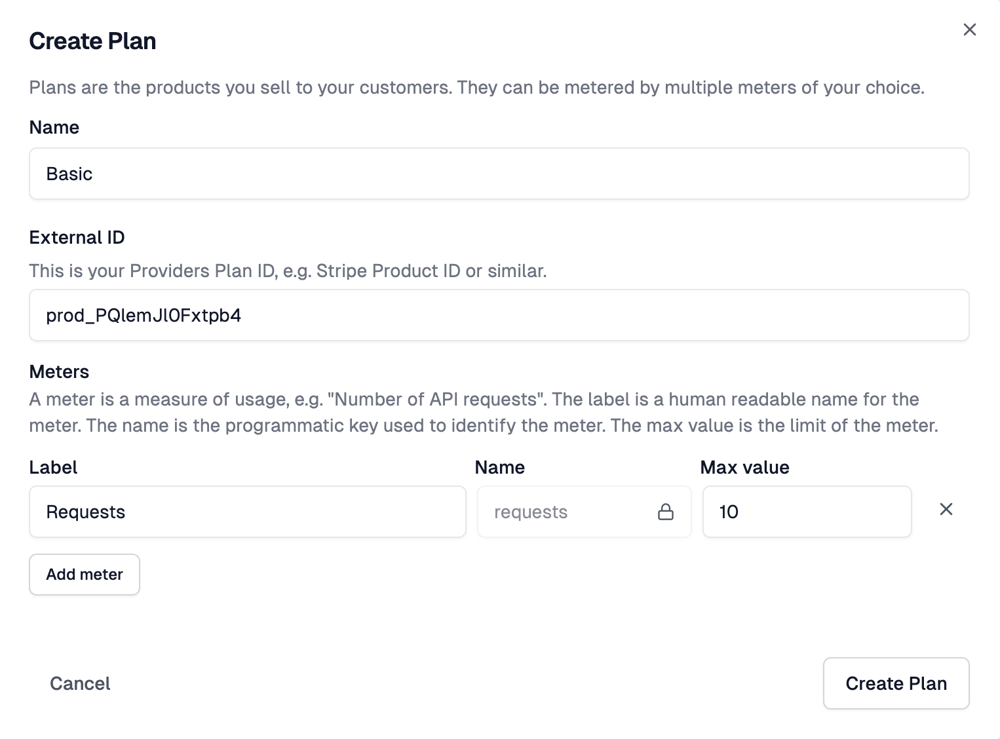
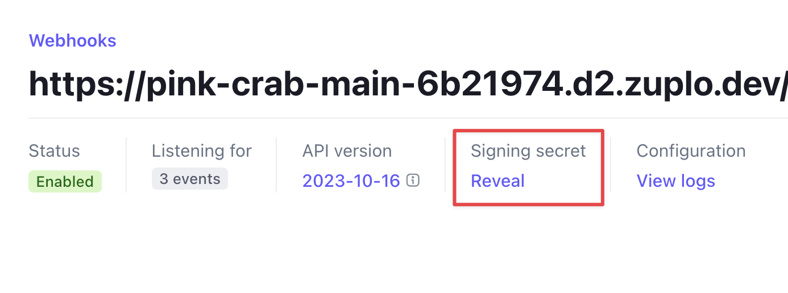
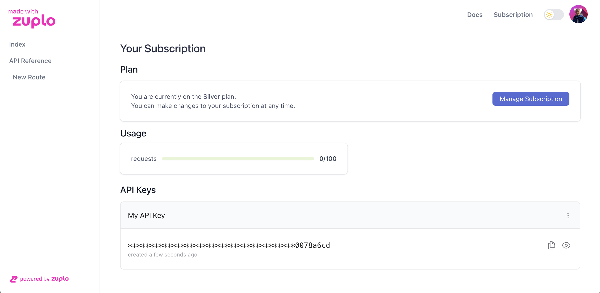

In the previous step, you configured the developer portal to enable your
customers to subscribe to your API. In order for Stripe to notify your API that
a customer has purchased a plan, you will next setup Stripe webhooks.

## 1/ Configure Plans

When Stripe calls your Zuplo API with a webhook event it will connect the Stripe
Subscription and Product with the Plan in your Zuplo API. In order for this to
work, you'll need to create Plans in your Zuplo Metering Service.

1. Click on the **Services** tab in the Zuplo portal and click **Configure** on
   your "Metering Service".



> You'll complete the next steps for each Stripe Product you added to your
> Pricing Table.

2. Click **Create Plan** to create your first Plan. Enter the name of your plan
   (i.e. Basic). The name typically will match the name of your Stripe Product.

3. The value of **External ID** is the ID of the Stripe Product. This value is
   found in the Stripe Dashboard in the
   [Product Catalog](https://dashboard.stripe.com/products). The value will
   start with `prod_`.



4. Next, set a Meter for the plan. To start, create a single meter called
   `Requests`.
5. Set the **Max Value** to the number of Requests the users on the plan is
   allowed to make against your API per month.

:::tip

To start with, set the value of the **Max Value** to a low number like `10`.
This will allow you to test the quota later on in this tutorial.

:::

## 2/ Setup the Zuplo Plugin

The Zuplo `StripeMonetizationPlugin` makes it easy to listen to Stripe Webhooks
that enable subscriptions. This plugin adds a webhook endpoint and configures
the
[Stripe Webhook Verification Inbound](/docs/policies/stripe-webhook-verification-inbound)
policy to secure the webhooks.

With this plugin installed and webhooks configured, your users will have an API
key created for them automatically after they complete the Stripe checkout.

1. To start, navigate to the **Code** section of the Zuplo portal. On the
   `modules` folder click the **+** button and select **Runtime Extension**.

:::tip

The `zuplo.runtime.ts` file is where you can
[register global plugins](https://zuplo.com/docs/articles/runtime-extensions#plugin-and-handler-extensions)
and [setup hooks](https://zuplo.com/docs/articles/runtime-extensions#hooks)
within your Zuplo API.

:::

2. Add the `StripeMonetizationPlugin` to your `zuplo.runtime.ts` file as shown
   below.

```ts
import {
  RuntimeExtensions,
  StripeMonetizationPlugin,
  environment,
} from "@zuplo/runtime";

export function runtimeInit(runtime: RuntimeExtensions) {
  // Create the Stripe Plugin
  const stripe = new StripeMonetizationPlugin({
    webhooks: {
      signingSecret: environment.STRIPE_WEBHOOK_SIGNING_SECRET,
    },
    stripeSecretKey: environment.STRIPE_SECRET_KEY,
  });
  // Register the plugin
  runtime.addPlugin(stripe);
}
```

The plugin is using two environment variables. The `STRIPE_SECRET_KEY` is the
same value that was added in the previous steps of this tutorial. The
`STRIPE_WEBHOOK_SIGNING_SECRET` is a value that you will get after you create a
new Webhook in Stripe.

## 3/ Setup the Stripe Webhook

1. Navigate to the
   [Webhooks section](https://dashboard.stripe.com/test/webhooks) in Stripe's
   portal. Click **+ Add Endpoint** to register a new webhook.

2. The **Endpoint URL** for your webhook is
   `<https://your-api-url.dev>/__plugins/stripe/webhooks`. Enter it in the form.

3. Click the **+ Select events** button and click to enable the following
   events. Click **Add events** after you have selected the three events.

   - `customer.subscription.created`
   - `customer.subscription.updated`
   - `customer.subscription.deleted`

4. Click **Add endpoint** to register your webhook.

5. With the webhook created, find the section called **Signing secret** and
   click the **Reveal** link. Copy this value.



6. Return to the Zuplo Portal and open the **Environment Variables** section
   under the **Settings** tab.

7. Create a new Environment Variable. Set it as a **Secret** and name the
   variable `STRIPE_WEBHOOK_SIGNING_SECRET`. Paste the value of webhook's
   **Signing secret** you copied earlier and click **Save**.

## 4/ Purchase a Subscription

With the Zuplo Plans and the Stripe Webhook configured, you can now test the end
to end subscription experience.

1. Navigate to the **Pricing** page in your Developer Portal.

2. Select a Plan and click **Subscribe**. If you are not already logged into the
   portal, you will be asked to do so first.

3. The Stripe checkout page will open. If you are using test mode, you can enter
   any [test payment method](https://docs.stripe.com/testing) you like.

:::tip

The test Stripe credit card number is `4242 4242 4242 4242` with any future date
as the expiration and any three digits as the CVC.

:::

4. Once you have completed the checkout, you will be returned to your Developer
   Portal. After a few seconds, you should see your subscription page with your
   API Key.



5. Return to the Zuplo Portal and open the **Logs** tab. Notice the logs that
   show information about the incoming webhook.

:::tip

If you are having trouble diagnosing issues with your Webhooks, the logs are a
good place to see what is going on. You can also open the
[**Webhooks**](https://dashboard.stripe.com/webhooks) page in Stripe and see the
history of webhook events and their responses.

:::

You now have an API Subscription and are almost ready to start monetizing your
API. In the next section you will see how to add policies to your routes,
enforce quotas and ensure that users are only allowed to use your API according
to their plan.
